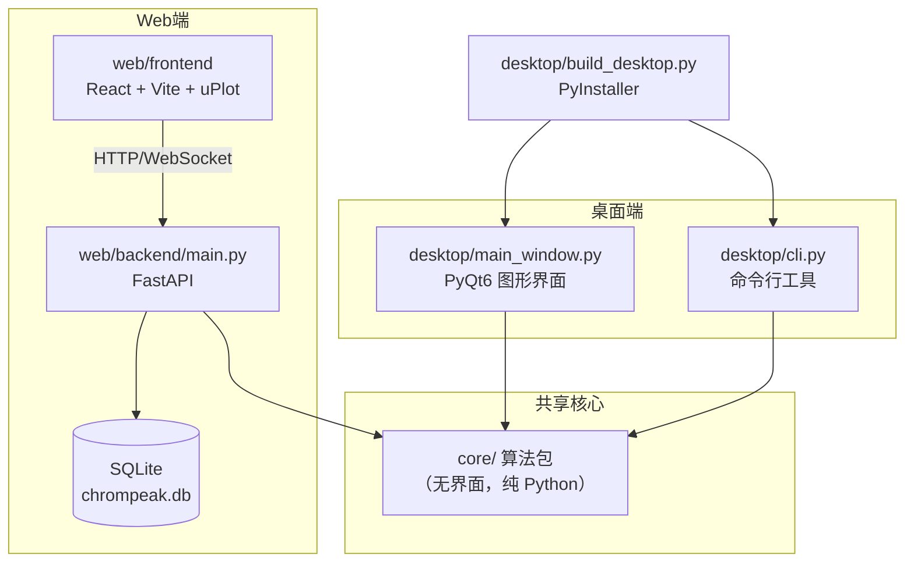

# ChromaPeak Studio · 色谱峰识别平台

> 一个开源的**气相 / 液相色谱峰识别**平台。同一套核心算法同时驱动 **桌面端（PyQt6 图形界面 + 命令行）** 与 **Web 端（React + FastAPI）**，可在本地一键打包成无需安装 Python 的 `.exe`，也能一键部署到 GitHub Pages / Cloudflare / Vercel / Netlify。

[](LICENSE)
[](https://www.python.org/)
[](https://nodejs.org/)

---

## 目录

- [这个项目能做什么](#这个项目能做什么)
- [整体架构](#整体架构)
- [界面布局（桌面端与 Web 端一致）](#界面布局桌面端与-web-端一致)
- [目录结构一览](#目录结构一览)
- [快速开始](#快速开始)
  - [方式一：Web 端（最简单，免安装）](#方式一web-端最简单免安装)
  - [方式二：桌面 GUI 版（PyQt6）](#方式二桌面-gui-版pyqt6)
  - [方式三：命令行版（CLI / 批处理 / 服务器）](#方式三命令行版cli--批处理--服务器)
  - [方式四：打包成 .exe（免安装 Python）](#方式四打包成-exe免安装-python)
  - [方式五：一键生成发布包](#方式五一键生成发布包)
- [每个文件的作用（新手必读）](#每个文件的作用新手必读)
  - [核心算法包 `core/`（与界面无关，可被两端复用）](#核心算法包-core与界面无关可被两端复用)
  - [桌面端 `desktop/`](#桌面端-desktop)
  - [Web 后端 `web/backend/`](#web-后端-webbackend)
  - [Web 前端 `web/frontend/`](#web-前端-webfrontend)
  - [测试、示例与部署配置](#测试示例与部署配置)
- [内置的 6 种识别算法](#内置的-6-种识别算法)
- [移动端与多设备适配](#移动端与多设备适配)
- [部署到各大平台](#部署到各大平台)
  - [1. GitHub Pages（自动化，推荐）](#1-github-pages自动化推荐)
  - [2. Cloudflare Pages](#2-cloudflare-pages)
  - [3. Vercel](#3-vercel)
  - [4. Netlify](#4-netlify)
- [接入真实后端 API](#接入真实后端-api)
- [开发过程中踩过的坑（避坑指南）](#开发过程中踩过的坑避坑指南)
- [常见问题 FAQ](#常见问题-faq)
- [许可证](#许可证)

---

## 这个项目能做什么

把一份色谱仪输出的 **CSV / TXT 数据**（两列：横轴时间 `x`、纵轴响应值 `y`），自动找出其中的 **色谱峰（peaks）**，给出每个峰的：

| 指标 | 含义 |
| --- | --- |
| `rt` | 保留时间（峰出现的位置） |
| `height` | 峰高 |
| `area` | 峰面积（积分） |
| `fwhm` | 半峰宽（峰宽度的衡量） |
| `asymmetry` | 不对称因子（拖尾程度） |
| `score` | 算法对该峰的置信度评分 |

平台内置 **6 种不同思路的峰识别算法**（导数法、小波变换、形态学、曲率法、指数修正高斯拟合、图神经网络），可以**同时跑多个算法并对比结果**，帮助判断峰是否真实存在。

---

## 整体架构



**核心设计思想**：`core/` 是一个**不带任何界面依赖**的纯算法包，桌面 GUI、命令行、Web 后端都只是它的"外壳"，这样算法只写一遍，三处共用，结果完全一致。

---

## 界面布局（桌面端与 Web 端一致）

两端采用**同一套"色谱工作站"布局**，学会一个就会另一个。视觉层也做了对齐：桌面端 `desktop/theme.py` 与 Web 端 `web/frontend/src/theme.ts` 里的算法编号（`ALG-D/E/W/M/C/GNN`）、中文名称、曲线配色**必须同步修改**，否则两端看起来会不一致。

```
┌──────────────────────────────────────────────────────────────┐
│ 顶栏：品牌标识 │ 文件 视图 算法 工具 帮助 │ 对比 批量 测量 导出 │
├────┬────────────────────────────────────┬────────────────────┤
│图标│                                    │ 右侧面板（可切换）  │
│栏  │        中央色谱图                   │ · 算法  列表+参数   │
│    │  （十字光标读数 / 可点选图例）       │ · 预处理 基线+平滑  │
│算法│                                    │ · 对比  指标横向表  │
│预处│                                    │ · 日志  运行记录    │
│对比│                                    │ · 关于  版本说明    │
│日志├────────────────────────────────────┤                    │
│关于│ 底部标签页：峰表 │ 结果 │ 文件信息   │                    │
├────┴────────────────────────────────────┴────────────────────┤
│ 状态栏：文件 · 点数 · 采样间隔 · 算法 · 峰数 · 耗时 · 光标读数   │
└──────────────────────────────────────────────────────────────┘
```

| 区域 | 桌面端（PyQt6） | Web 端（React） |
| --- | --- | --- |
| 顶栏菜单 | `QMenuBar` + 品牌 `cornerWidget` | `components/TopBar.tsx` |
| 左图标栏 | `_build_rail()` 的 `QToolButton` | `components/IconRail.tsx` |
| 中央色谱图 | `pyqtgraph.PlotWidget` + `InfiniteLine` 十字光标 | `components/Chromatogram.tsx`（uPlot） |
| 右侧面板 | `QStackedWidget`（算法/预处理/对比/日志/关于） | `AlgorithmPanel` / `PreprocessPanel` / `ComparePanel` / `LogPanel` / `AboutPanel` |
| 底部标签页 | `QTabWidget`（峰表/结果/文件信息） | `components/BottomPanel.tsx` + `PeakTable.tsx` |
| 状态栏 | `QStatusBar` + 多个 `QLabel` | `BottomPanel.tsx` 内的 `.statusbar` |
| 算法列表行 | `AlgRow`（勾选 + 色条 + 执行 + 峰数/耗时） | `AlgorithmPanel.tsx` 的行渲染 |

> **交互约定（两端一致）**：拖动图表框选放大、右键复位；鼠标移动显示 `t = 时间 / 响应` 读数；点击左上角图例显隐曲线；算法列表点「执行」只跑该算法并单独计时；参数改动 **200ms（桌面）/ 250ms（Web）防抖**后自动重算。

---

## 目录结构一览

```
chrompeak-studio/
├── core/                     # 核心算法包（纯 Python，无界面）—— 三端共用
│   ├── algorithms/           # 6 种峰识别算法
│   ├── io.py                 # 读取/写出色谱数据
│   ├── preprocess.py         # 基线校正、平滑等预处理
│   ├── peak_params.py        # 计算 FWHM / 不对称因子
│   ├── pipeline.py           # 统一调度入口（跑单个/全部算法）
│   ├── sample_data.py        # 生成演示数据（无需外部文件）
│   └── __main__.py           # 支持 `python -m core` 直接体验算法
├── desktop/                  # 桌面端
│   ├── main_window.py        # PyQt6 图形界面主窗口（工作站布局）
│   ├── theme.py              # 统一视觉层：深色 QSS + 算法编号/配色 + 字体兜底
│   ├── param_panel.py        # 根据算法参数自动生成表单
│   ├── batch_dialog.py       # 批量处理对话框
│   ├── cli.py                # 命令行版本（无界面）
│   ├── build_desktop.py      # PyInstaller 打包（onedir 便携目录 / onefile 单文件）
│   ├── requirements.txt      # 桌面端依赖
│   └── installer.iss         # Inno Setup 安装包脚本（可选）
├── web/
│   ├── backend/              # FastAPI 后端
│   │   ├── main.py           # 接口与 WebSocket
│   │   ├── auth.py           # 注册/登录/JWT
│   │   ├── db.py             # SQLite 用户与项目存储
│   │   └── requirements.txt
│   └── frontend/             # React + Vite 前端
│       ├── src/
│       │   ├── App.tsx       # 主页面与交互逻辑
│       │   ├── theme.ts      # 统一视觉层（与 desktop/theme.py 对齐）
│       │   ├── api.ts        # 后端通信封装
│       │   ├── analysis.ts   # 前端离线算法引擎（无后端时在浏览器出峰）
│       │   ├── components/   # 顶栏/图标栏/色谱图/右侧面板/峰表/状态栏
│       │   ├── utils/        # lttb 降采样 / ZIP 批量 / 本地项目仓库
│       │   └── styles.css    # 样式与移动端适配
│       ├── index.html
│       ├── vite.config.ts    # 构建配置（base: "./" 相对路径）
│       ├── vercel.json / netlify.toml / wrangler.toml  # 平台部署配置
│       └── package.json
├── tests/                    # 单元测试
├── sample_data/              # 演示用 CSV / 项目 JSON
├── package_release.py        # 一键生成源码包 / 静态站包 / 便携 exe 包
├── release/                  # 发布包输出目录（已 gitignore）
├── .github/workflows/deploy.yml  # GitHub Actions 自动部署
└── start_desktop.bat         # 双击启动桌面端的脚本
```

---

## 快速开始

> 三个环境准备：
> - Python 3.13（推荐用虚拟环境 `venv`）
> - Node.js 20+（仅 Web 前端需要）
> - 核心算法只用 `numpy` / `scipy`，安装很轻量

### 方式一：Web 端（最简单，免安装）

Web 端是**纯静态前端**，即使没有后端也能用（前端内置示例数据、算法对比在前端做）。两种用法：

**A. 仅本地预览前端（不需要 Python）：**

```bash
cd web/frontend
npm install
npm run dev        # 打开 http://localhost:5173
```

### 🌐 在线演示（直接体验，无需安装）

**<https://zhixiaotx.github.io/chrompeak-studio/>**

打开即用，**不需要登录、不需要后端**。页面会自动检测后端是否可用：

- **有后端** → 走 FastAPI，支持注册/登录、云端保存项目、后端 ZIP 批量；
- **无后端**（如 GitHub Pages 这种纯静态托管）→ 自动切换**离线模式**，顶部出现黄色提示条，算法在浏览器本地跑，连「保存项目」「ZIP 批量」也能用（分别落到浏览器 localStorage 和本地打 ZIP 下载）。

> **离线也能用**：部署到纯静态平台（GitHub Pages / Cloudflare / Vercel / Netlify）时，前端在加载后端接口失败后会**自动切换「离线演示模式」**——用 TypeScript 实现的核心算法在浏览器里直接出峰（见 `web/frontend/src/analysis.ts`），并内置示例数据。离线模式下**免登录**，除注册/登录、云端保存外其余功能全部可用（分析、JSON 导入导出、本地 ZIP 批量、本地保存项目）。也因此不会因请求不存在的后端而报 404/405。

**B. 完整运行（前端 + 后端 API + 登录/保存项目）：**

```bash
# 终端 1：启动后端
cd web/backend
python -m venv venv && venv\Scripts\activate   # Linux/macOS 用 source venv/bin/activate
pip install -r requirements.txt
uvicorn main:app --reload --port 8000

# 终端 2：启动前端
cd web/frontend
npm install
npm run dev
```

打开 http://localhost:5173 即可。前端通过 `vite.config.ts` 里的 `/api` 代理把请求转发到 `localhost:8000`，**本地开发没有跨域问题**。

### 方式二：桌面 GUI 版（PyQt6）

```bash
cd desktop
python -m venv venv && venv\Scripts\activate
pip install -r requirements.txt
python -m desktop.main_window     # 或直接双击 start_desktop.bat
```

界面左侧选算法 + 调参数，中间看色谱图与峰，右侧看结果表，支持导出 CSV / Excel / 图片。

### 方式三：命令行版（CLI / 批处理 / 服务器）

```bash
# 分析单个文件（--out 可导出 csv/xlsx）
python -m desktop.cli analyze sample_data/demo.csv --algorithms ALG-D ALG-E --out out.csv

# 用内置示例数据
python -m desktop.cli analyze sample --out out.csv

# 批量处理整个文件夹
python -m desktop.cli batch ./data_dir --out-dir out --algorithms ALG-D

# 保存为项目 JSON / 从项目 JSON 重算
python -m desktop.cli project data.csv --out project.json
python -m desktop.cli rerun   project.json --out peaks.csv
```

`python -m core` 也能直接体验核心算法（读取示例数据并输出各算法峰数）。

### 方式四：打包成 .exe（免安装 Python）

`desktop/build_desktop.py` 用 PyInstaller 打包，**目标电脑不需要安装 Python**。它支持两种形态，默认**两种都产出**：

```bash
pip install -r desktop/requirements.txt

python desktop/build_desktop.py                    # onedir + onefile 都产出（默认）
python desktop/build_desktop.py --mode onedir      # 只要便携目录版
python desktop/build_desktop.py --mode onefile     # 只要单文件版
```

| 模式 | 产物 | 启动速度 | 分发方式 |
| --- | --- | --- | --- |
| `onedir` | `dist/ChromaPeakStudio/ChromaPeakStudio.exe`<br>`dist/ChromaPeakCLI/ChromaPeakCLI.exe` | **约 3 秒** | 必须带上同目录的 `_internal/`，即整个文件夹一起拷 |
| `onefile` | `dist/ChromaPeakStudio.exe`<br>`dist/ChromaPeakCLI.exe` | 约 20~30 秒 | 单个 exe，拷走即可 |

> **怎么选**：onefile 每次运行都要把上百 MB 的内置依赖解压到 `%TEMP%\_MEIxxxxx`，进程结束后再删掉，所以冷启动慢；onedir 直接加载同目录的 `_internal/`，无需解压。
> 要「快」选 onedir，要「一个文件」选 onefile。功能完全一致。

两种模式各自的 GUI / CLI 体积参考（实测，单位 MB）：

| 模式 | GUI | CLI |
| --- | --- | --- |
| onedir（整个文件夹） | ~277 | ~277 |
| onefile（单个 exe） | ~110 | ~79 |

> CLI 的单文件比 GUI 小 31 MB，是因为 CLI 版本**不打包 PyQt6 / pyqtgraph**（`cli.py` 只用 `core`）。早期版本两者都是统一 `--collect-all desktop`，导致命令行版白白背上整套 Qt —— 见避坑指南 #24。

详见下文「[开发过程中踩过的坑](#开发过程中踩过的坑避坑指南)」中关于 PyInstaller 的注意事项。

### 方式五：一键生成发布包

如果你需要**把成果分发给别人**（或者自己留档），跑根目录下的 `package_release.py`，一条命令产出互相独立、按需取用的压缩包：

```bash
# 先按需准备好前置产物
python desktop/build_desktop.py                  # 生成 dist/（打 exe 包用）
cd web/frontend && npm run build && cd ../..     # 生成 web/frontend/dist（打静态包用）

# 一键打包（全部）
python package_release.py

# 只要其中某几个：可选 src / web / exe / onefile
python package_release.py --only src,web
python package_release.py --out-dir D:/deliver
```


产物落在 `release/` 下：

| 包名 | 体积（参考） | 内容 | 给谁用 |
| --- | --- | --- | --- |
| `ChromaPeakStudio-src-<ver>.zip` | ~190 KB | **纯源码**：`core/` 算法包、`desktop/`、`web/`（前后端源码）、`tests/`、`.github/` CI、`README.md`、`sample_data/` | 想二次开发 / 想自己编译的人 |
| `ChromaPeakStudio-web-<ver>.zip` | ~125 KB | **静态站产物**：`index.html` + `assets/` + `404.html`，**ZIP 根目录就是站点根目录** | 只想部署网站的人（解压即上线） |
| `ChromaPeakStudio-exe-<ver>.zip` | ~226 MB | **Windows 便携目录版**：`ChromaPeakStudio/`（GUI）+ `ChromaPeakCLI/`（CLI）两个 onedir 目录，**启动约 3 秒** | 不想装 Python、且在意启动速度的终端用户 |
| `ChromaPeakStudio-onefile-<ver>.zip` | ~188 MB | **Windows 单文件版**：`ChromaPeakStudio.exe`（~110 MB）+ `ChromaPeakCLI.exe`（~79 MB），各是独立单文件，**启动约 20~30 秒** | 只想要「一个文件」的终端用户 |

**设计约定**（都是踩过坑之后定的）：

- 每个包内都放一份 `RELEASE_MANIFEST.txt`，写明**包内容 + 构建来源 + 使用方式 + 验证步骤**，拿到包的人不用回来翻 README。exe 类包还会写明 onedir / onefile 的启动速度差异，避免用户以为「双击没反应 = 坏了」。
- 源码包**自动排除** `node_modules/`、`venv/`、`dist/`、`build/`、`__pycache__/`、`*.pyc`、`*.spec`、`*.log`、`*.db`，以及 `_old_*` 归档目录；单个文件超过 25 MB 会被跳过并在控制台提示，防止误把大文件打进去。之所以能压到 190 KB，就是因为这些全都排掉了。
- 静态包**不包含后端**，部署后前端自动进入「离线演示模式」（算法在浏览器本地跑），因此**不会**出现请求不存在后端导致的 404 / 405。需要云端账号与保存时，再单独部署 `web/backend`。
- **只读源目录、只写 `release/`，从不删除任何已有文件**：如果同名包已存在，会自动加时间戳后缀（如 `...-src-0.1.0_v090836.zip`）而不是覆盖。
- 前置产物缺失时（比如还没 `npm run build`、或只构建了 onedir 没构建 onefile）会打印明确提示并跳过该包，**不会**产出一个空包。
- `release/` 已加入 `.gitignore`，不会把几百 MB 的 exe 包提交进仓库。

各包的验证方式不同，最简单的自检：

```bash
# 源码包：确认解压后只有一个顶层目录，且没有构建产物混入
unzip -l release/ChromaPeakStudio-src-*.zip        # 条目应以 chrompeak-studio/ 开头

# 静态包：解压后直接起服务，页面应出现黄色「离线演示模式」提示条并正常出峰
python -m http.server 8000

# 便携目录版：解压后双击 ChromaPeakStudio.exe，应很快出界面、文字是正常中文而非方块
# 单文件版：双击后需等 20~30 秒（正在解压依赖）才出界面，属正常
```

> 这两类 exe 包的体积差异主要来自打包方式：onefile 把依赖压缩进 exe 内部，所以单个文件大、启动要解压；onedir 把依赖摊在 `_internal/` 里，文件多但不用解压。


---

## 每个文件的作用（新手必读）

下面按"从底层到外壳"的顺序，逐个说明文件的职责。你可以把它当成一份"源码地图"。

### 核心算法包 `core/`（与界面无关，可被两端复用）

| 文件 | 作用 |
| --- | --- |
| `core/__init__.py` | 让 `core` 成为一个可被 `import` 的包；对外暴露常用函数 |
| `core/__main__.py` | `python -m core` 的入口：生成示例数据、依次跑全部算法、打印峰数，方便无界面快速验证算法 |
| `core/algorithms/base.py` | **算法基类** `PeakAlgorithm`（抽象类）。定义所有算法都要实现的 `default_params()` 和 `detect()`；并提供公共工具：`_resolve`（参数取值）、`_local_maxima`（找局部极大值）、`_baseline_segment`（分段基线） |
| `core/algorithms/_helpers.py` | 峰后处理工具：`enforce_min_distance`（按最小峰间距去重）、`refine_apex`（把峰顶点精修到最优点）、`peak_boundaries`（确定峰的左右边界）、`local_baseline`（取峰附近局部基线用于积分） |
| `core/algorithms/derivative.py` | **ALG-D 导数法**：一阶导数过零点定位峰。最经典、最快 |
| `core/algorithms/cwt.py` | **ALG-W 连续小波变换**：用 Ricker（墨西哥帽）小波做多尺度脊线检测。因 `pywt` 在 Python 3.13 暂无轮子，本文件**手写实现了 Ricker 小波与 CWT**，无第三方硬依赖 |
| `core/algorithms/tophat.py` | **ALG-M 形态学顶帽**：用形态学开运算提取"比背景亮的突起"，对宽峰友好 |
| `core/algorithms/curvature.py` | **ALG-C 曲率法**：用二阶导数（曲率）找凹点。阈值采用"相对阈值" `0.2 * 最大曲率`，避免绝对值在不同信号量级下失效 |
| `core/algorithms/emg_fit.py` | **ALG-E 指数修正高斯拟合**：用 EMG 模型拟合峰并解重叠峰。内部自带基线校正；阈值相对化 `0.2 * ymax`，并先做 Savitzky-Golay 平滑抑制噪声 |
| `core/algorithms/gnn_deconv.py` | **ALG-GNN 图神经网络解卷积**：优先加载 `models/` 下的 ONNX 模型做推理；若无模型则用"二阶导 + 相对阈值"回退。阈值相对化 `thr = -0.2 * dmax` |
| `core/algorithms/__init__.py` | **算法注册表**：`_REGISTRY` 收集全部算法；提供 `all_algorithms()`、`get_algorithm()`、`algorithm_meta()` 供桌面/Web 自动列出可用算法及其参数 |
| `core/io.py` | 数据读写：`load_chromatogram()`（读 CSV/TXT，自动识别两列）、`load_from_bytes()`（供 Web 从上传字节流读取）、`save_peaks_csv()`（导出峰为 CSV，**兼容 Peak 对象与字典两种格式**） |
| `core/preprocess.py` | 预处理：`PreprocessOptions`、`_airpls_baseline`（非对称最小二乘基线校正）、`baseline_correction`、`savgol_smooth`（Savitzky-Golay 平滑）、`preprocess`（统一入口） |
| `core/peak_params.py` | 峰指标计算：`calc_peak_params`（算单峰 FWHM/不对称）、`calc_all`（批量） |
| `core/pipeline.py` | **统一调度层**：`available_algorithms()`（列出元信息）、`analyze(x, y, name, params)`（跑单个算法）、`run_algorithms(x, y, names, params)`（跑多个，返回 `{x, y, y_proc, results}`）。桌面端与 Web 后端都调用它 |
| `core/sample_data.py` | 演示数据生成：`synthetic_chromatogram()`（带噪声的合成色谱）、`overlapping_pair()`（重叠双峰，用于测试解卷积）、`_emg()`（指数修正高斯函数，已做数值溢出保护） |

### 桌面端 `desktop/`

| 文件 | 作用 |
| --- | --- |
| `desktop/main_window.py` | **PyQt6 主窗口（工作站布局）**：顶栏菜单 + 品牌区、左图标栏、中央 pyqtgraph 色谱图（十字光标 + 可点选图例）、右侧 `QStackedWidget` 面板（算法/预处理/对比/日志/关于）、底部标签页（峰表/结果/文件信息）、状态栏。参数改动后 **200ms 防抖**实时重算；支持导出 CSV / Excel / PNG / 批量 |
| `core/algorithms/_helpers.py` | 算法公共小工具：`enforce_min_distance` 最小间距压制、`refine_apex` 顶点细化、`dedup_identical_peaks` **同 apex 去重护栏**（防止一个峰被数成两条，见避坑 #26） |
| `desktop/theme.py` | **统一视觉层**：深色 QSS 主题、算法编号/中文名/配色映射（`ALG_VISUALS`）、色板常量；并提供 `install_fonts()` 字体兜底（见避坑 #21）。改配色时与 `web/frontend/src/theme.ts` **一起改** |
| `desktop/param_panel.py` | `ParamPanel`：读取算法 `ParamSpec`（同时兼容对象与 dict 两种元数据），**自动生成参数表单**（输入框/勾选），改动时发出 `paramsChanged` 信号 |
| `desktop/batch_dialog.py` | `BatchDialog`：选择文件夹 + 算法，批量跑并把每个文件的峰导出到输出目录 |
| `desktop/cli.py` | **命令行版**：`analyze` / `batch` / `project` / `rerun` 四个子命令，适合服务器、CI、批处理。与 GUI 共用同一份 `core` |
| `desktop/build_desktop.py` | **打包脚本**：调用 PyInstaller 产出 GUI / CLI 两个目标。支持 `--mode both\|onedir\|onefile`（默认 both）。两条关键设计：① GUI 专属依赖（`--collect-all pyqtgraph` / `desktop`）与 CLI 依赖**分开传参**，避免 CLI 背上 76 MB 的 PyQt6（避坑 #24）；② 探测 `models/*.onnx` 是否存在，**有才打包** 41 MB 的 onnxruntime（避坑 #25）。把 `core` 与 `models` 作为数据打包进去 |
| `desktop/requirements.txt` | 桌面端依赖清单（PyQt6 / pyqtgraph / numpy / scipy / onnxruntime / openpyxl / PyInstaller） |
| `desktop/installer.iss` | Inno Setup 脚本，可把两个 `.exe` 打包成一个 Windows 安装程序（可选） |
| `desktop/__init__.py` | 让 `desktop` 成为可 `import` 的包 |

### Web 后端 `web/backend/`

| 文件 | 作用 |
| --- | --- |
| `web/backend/main.py` | **FastAPI 主程序**。路由：`/register`、`/login`、`/algorithms`、`/analyze`、`/analyze_batch`、`/projects`（增/列/查）、`/ws/analyze`（WebSocket 流式推理）；挂载 `/exports` 静态目录用于下载批量结果。`main:app` 是 uvicorn 启动入口 |
| `web/backend/auth.py` | **鉴权**：用 `bcrypt` 做密码哈希/校验（**未用 passlib**，见避坑指南），`python-jose` 签发/校验 JWT；`get_current_user` 依赖项保护需要登录的接口 |
| `web/backend/db.py` | **SQLite 持久化**：`User`、`Project` 两张表（SQLAlchemy ORM）；`chrompeak.db` 默认在后端目录，可用环境变量 `CHROMPEAK_DB` 指定路径。`x_data`/`y_data` 以 JSON 文本存储 |
| `web/backend/requirements.txt` | 后端依赖（fastapi / uvicorn / sqlalchemy / bcrypt / python-jose / python-multipart） |
| `web/backend/__init__.py` | 包标识，使 `auth` / `db` 可作为相对导入的子模块 |

### Web 前端 `web/frontend/`

| 文件 | 作用 |
| --- | --- |
| `index.html` | 应用入口 HTML，`<div id="root">` 挂载点；引入 `./assets/...`（**相对路径**，便于部署到子目录） |
| `vite.config.ts` | Vite 配置：`base: "./"`（构建产物全部用相对路径）、`/api` 代理到 `localhost:8000`（本地开发免跨域）、`chunkSizeWarningLimit` 放宽 |
| `package.json` | 依赖与脚本：`dev` / `build` / `preview`。运行时依赖仅 4 个：`react`、`react-dom`、`uplot`、`jszip`（`jszip` 用于**离线 ZIP 批量**在浏览器里读写压缩包） |
| `src/main.tsx` | React 渲染入口 |
| `src/theme.ts` | **统一视觉层**：`ALG_VISUALS`（算法编号/中文名/曲线颜色/一句话说明）、`algVisual()`、`AlgRunStat` 类型、`DEFAULT_PREPROCESS` 预处理默认值。**与 `desktop/theme.py` 一一对应，改色两端一起改** |
| `src/App.tsx` | **主页面与全部交互**：后端可达性探测（`backendOk` 三态：检测中 / 在线 / 离线）、文件上传、参数调优后 **250ms 防抖**重算（在线走 WebSocket 流式，离线走本地引擎）、项目保存/加载、JSON 导入导出、ZIP 批量、本地项目列表。**主界面无需登录即可使用**；登录只是顶栏里一张可折叠卡片 |
| `src/analysis.ts` | **离线算法引擎（TypeScript 版）**：无后端时在浏览器里跑完 6 种算法并出峰。内含基线估计、均值/高斯平滑、差分高斯（近似墨西哥帽小波）、形态学顶帽、FWHM/面积/不对称因子计算；对外导出 `analyzeLocal`、`analyzeLocalOne`（单算法计时）、`preprocessForDisplay`（支持预处理参数）、`parseCsvText`/`parseCsvFile`、`syntheticChromatogram`（示例数据）、`LOCAL_ALGORITHMS`。**纯前端、零请求、可在任何静态托管上运行** |
| `src/api.ts` | **后端通信封装**：`API_BASE`（优先读 `VITE_API_BASE`，否则 `/api`）、`api` 对象（register/login/algorithms/analyze/analyzeBatch/projects）、`wsUrl()` 生成 WebSocket 地址。新增 `BackendUnavailableError` + `readableError()`：把静态托管返回的 404/405 HTML 兜底页翻译成可读中文错误，App 据此判定"后端不存在"。集中所有请求，改地址只动这一处 |
| `src/components/TopBar.tsx` | **顶栏**：品牌标识 + 文件/视图/算法/工具/帮助菜单 + 右侧动作按钮（对比 / 批量 / 测量 / 导出）+ 用户区 |
| `src/components/IconRail.tsx` | **左图标栏**：算法 / 预处理 / 对比 / 日志 / 关于 五个面板的切换入口（选中态左侧高亮条） |
| `src/components/Chromatogram.tsx` | **色谱图组件**（uPlot）：原始曲线 + 处理后曲线 + 每个算法一组彩色散点；用 LTTB 降采样保证大文件流畅，`ResizeObserver` 跟随容器宽度自适应；十字光标 + 右上角 `t / 响应` 读数；左上角可点选图例显隐曲线。序列数量变化时重建图表，否则只 `setData` 增量更新 |
| `src/components/AlgorithmPanel.tsx` | **算法面板**：搜索框 + 全选/全不选 + 算法行列表（勾选框、色条、编号、`执行` 按钮、峰数/耗时状态）；点行展开该算法的参数表单 |
| `src/components/PreprocessPanel.tsx` | **预处理面板**：基线校正（阶数/迭代/容差）与 Savitzky-Golay 平滑（窗口/阶数）参数，改动即重算 |
| `src/components/ComparePanel.tsx` | **对比面板**：各算法 峰数 / 耗时 / 平均峰高 / 不对称 / 置信度 横向对照表 |
| `src/components/LogPanel.tsx` | **日志面板**：运行记录（载入 / 运行 / 导出 / 错误），带时间戳与颜色分级 |
| `src/components/AboutPanel.tsx` | **关于面板**：版本、架构说明、算法清单与快捷操作提示 |
| `src/components/PeakTable.tsx` | **峰表**：来源筛选 + 关键字过滤 + **仅共识峰**开关 + 全部峰的指标表格（序号/rt/最小点/峰高/面积/峰宽/分离度/不对称/置信度/**共识**/来源算法/**算法实例**）。序号在筛选后重编，始终 1..N 连续；共识列为 `x/N`（该保留时间上被几个算法共同检出），孤峰整行压暗 |
| `src/components/BottomPanel.tsx` | **底部区域**：峰表 / 结果（共识峰）/ 文件信息 三个标签页 + 底部状态栏（文件 · 点数 · 采样间隔 · 算法 · 峰数 · 耗时 · 光标）。峰表的共识度直接复用「结果」页的 `buildClusters`，两处口径一致 |
| `src/components/Auth.tsx` | 登录/注册表单。**离线模式（`disabled`）下输入框与按钮全部禁用**，并提示"离线演示模式下无需登录"，从源头避免向不存在的后端发 POST 而报 405 |
| `src/utils/localProjects.ts` | **本地项目仓库**：离线模式下的「保存项目」。把 `name / algorithms / params / x / y / results` 存进 `localStorage`，支持列出、读取、删除、改名；写入超限时自动丢弃最旧项目，避免 `QuotaExceededError` |
| `src/utils/localBatch.ts` | **离线 ZIP 批量**：用 `jszip` 在浏览器里解压上传的 ZIP → 逐个 CSV 走本地引擎出峰 → 汇总 `summary.csv` + 每个文件一个 `peaks/xxx_peaks.csv` → 再打包成新 ZIP 下载。每处理完一个文件 `setTimeout(0)` 让出主线程，避免大数据量时页面假死 |
| `src/utils/lttb.ts` | **LTTB 降采样算法**：把上万点的曲线压缩到屏幕宽度的 2 倍点数，保留视觉形状 |
| `src/styles.css` | 全部样式（深色主题 CSS 变量 + flex 布局：顶栏/图标栏/中央/右侧面板/底部/状态栏）+ **移动端适配**（`@media` 断点 860px / 480px，见下文），另含 `.offline-banner`、`.auth-card`、`.proj-list` |
| `src/vite-env.d.ts` | 声明 `vite/client` 类型，使 `import.meta.env` 可用 |
| `public/404.html` | SPA 兜底页（刷新深层链接时不 404） |
| `vercel.json` / `netlify.toml` / `wrangler.toml` | 三大平台的部署配置（重写到 `index.html`，启用 SPA） |

### 测试、示例与部署配置

| 文件 | 作用 |
| --- | --- |
| `tests/test_core.py` | 核心算法单元测试（10 个用例，覆盖各算法能出峰、参数边界等），`pytest` 运行 |
| `conftest.py` | pytest 配置（把项目根加入 `sys.path`） |
| `sample_data/*.csv` | 演示 CSV（单文件 / 批处理 / exe 测试） |
| `sample_data/project.json` | 项目 JSON 示例，用于演示导入导出 |
| `sample_data/out/` | CLI 运行产物示例 |
| `.github/workflows/deploy.yml` | **GitHub Actions**：push 到 `main` 时自动 `npm ci && npm run build`，把 `web/frontend/dist` 部署到 `gh-pages` 分支 |
| `start_desktop.bat` | Windows 双击启动桌面端的批处理（自动建 venv 并安装依赖） |
| `package_release.py` | **发布打包脚本**（见「[方式五](#方式五一键生成发布包)」）：一条命令产出源码包 / 静态站包 / 便携目录包(onedir) / 单文件包(onefile)，每包内附 `RELEASE_MANIFEST.txt` 清单（含包内容、使用方式、验证步骤，exe 类还写明了启动速度差异）；只写 `release/`、从不删除已有文件，重名自动加时间戳 |

---

## 内置的 6 种识别算法

| 算法 | 名称 | 思路 | 适合场景 |
| --- | --- | --- | --- |
| `ALG-D` | 导数法 | 一阶导数过零点 | 快速初筛、信号干净 |
| `ALG-W` | 小波变换 | Ricker 小波多尺度脊线 | 峰宽差异大、重叠 |
| `ALG-M` | 形态学顶帽 | 开运算提取突起 | 宽峰、基线漂移 |
| `ALG-C` | 曲率法 | 二阶导数凹点 | 对称峰、尖锐峰 |
| `ALG-E` | EMG 拟合 | 指数修正高斯拟合 | 拖尾峰、重叠峰解卷积 |
| `ALG-GNN` | 图神经网络 | ONNX 推理（无模型则回退二阶导） | 复杂/已知分布数据 |

> 多算法对比的价值：**没有单一算法是万能的**。某个峰如果多个算法都报出来，基本可确认；只有某个奇怪的算法报出、其他都没有，大概率是噪声。

---

## 移动端与多设备适配

前端已针对手机、平板、桌面做了响应式适配，关键做法：

1. **相对路径构建**：`vite.config.ts` 里 `base: "./"`，构建产物 `index.html` 引用 `./assets/...`，因此**部署到任意子路径（如 `用户名.github.io/chrompeak-studio`）都不会白屏**。

2. **流式布局 + 断点**（`src/styles.css`）：
   - 桌面（> 860px）：左 `300px` 侧边栏 + 右侧主区横排。
   - 平板 / 横屏手机（≤ 860px）：`.layout` 改为竖向堆叠，侧边栏占满宽度、去掉最大高度限制；按钮加大到 `10px 12px` 触摸更友好；参数表单列宽收窄。
   - 小屏手机（≤ 480px）：隐藏顶栏用户名、卡片内边距收紧，信息密度更高。

3. **图表自适应**：`Chromatogram.tsx` 用 `ResizeObserver` 监听容器宽度，窗口/屏幕变化（含手机旋转）时实时 `setSize`，曲线始终填满可用宽度。

4. **大数据不卡**：`utils/lttb.ts` 用最大三角桶降采样，即使几万点也只在屏幕上绘制约 `2 × 宽度` 个点。

5. **SPA 兜底**：`public/404.html` + 各平台 `rewrites` 配置，保证在 GitHub Pages / Cloudflare / Vercel / Netlify 上刷新任意路径都不会 404。

### 移动端特殊适配（本项目实际踩到的问题）

上面的通用适配还不够——以下 4 条是本项目在移动端真机调试后才加的：

6. **触摸双指缩放时 Chrome 会临时接管合成层，导致图表断帧堆叠 → 视觉上"整页在闪"**
   - **现象**：手机上双指缩放、或快速滑动后，图表区域出现明显的层叠撕裂/闪烁。
   - **原因**：缩放过程中浏览器改变了图层合成方式，滚动容器被提升/回落。
   - **解决**：给滚动容器显式加 `will-change: transform` 并配合 `overflow-anchor: none`，避免合成层反复提升。

7. **高度必须为 auto / 至少 `600px`，不能用 `100%`**
   - **现象**：移动端图表被压扁、甚至高度塌陷为 0。
   - **原因**：父级是 flex 布局时，`height: 100%` 在移动端 Safari/Chrome 下解析不稳定。
   - **解决**：图表容器高度写 `auto`，并给 `min-height: 600px` 兜底。

8. **`Input[type=file]` 的 `size=5` / `size=10` 在移动端行为不可控**
   - **现象**：上传按钮在手机上宽度飘忽，有时被裁切。
   - **解决**：去掉 `size` 属性，改用 **CSS 类**统一控制宽度（视觉文案与实际宽度一致）。

9. **负路径段检查：`path.split("/")` 后必须过滤**
   - **现象**：某些 ZIP / 服务端返回的路径里会出现空段或 `-100` 之类的负号残留（例如 `.../-100/foo.csv`），导致文件名解析异常。
   - **解决**：对每一段做过滤后再 `join`，例如：
     ```ts
     const p = path.split("/").filter(s => !/^-\d+$/.test(s)).join("/");
     ```

---

## 部署到各大平台

前端是**纯静态产物**（`web/frontend/dist`），所以下面四种方式本质都是"构建 → 把 dist 托管为静态站点"。**构建命令统一为**：

```bash
cd web/frontend
npm install
npm run build      # 产物在 web/frontend/dist
```

### 1. GitHub Pages（自动化，推荐）

仓库已包含 `.github/workflows/deploy.yml`，**推送到 `main` 分支即自动构建并发布到 `gh-pages` 分支**（底层用的就是上面那条 `subtree` 命令，全自动、带 `--force` 覆写）：

```bash
git add . && git commit -m "feat: 更新 ChromaPeak Studio"
git push origin main
```

然后在 GitHub 仓库 **Settings → Pages → Source** 选择 `gh-pages` 分支、`/ (root)`，保存后访问 `https://<用户名>.github.io/<仓库名>/`。

> 因为用了相对路径 `base: "./"`，子路径部署无需额外配置。
> 推送后到仓库 **Actions** 页看运行是否变绿；首次发布要等 1~2 分钟缓存生效。

**如果仓库没开 Actions，或想本地手动发布**，可手工执行等价操作：

```bash
# 1) 先构建
cd web/frontend
npm install
npm run build

# 2) 把 dist 作为 gh-pages 分支推送（任选其一）
npx gh-pages -d dist                       # 方式 A：用 gh-pages 包，最省事
# git subtree push --prefix dist origin gh-pages   # 方式 B：原生 git

# 3) 首次需启用 Pages
gh api -X POST /repos/<owner>/<repo>/pages -F "source[branch]=gh-pages" -F "source[path]=/"
```

> 注意：GitHub Pages 默认启用 Jekyll，会忽略以 `_` 开头的目录/文件。dist 里若带 `_` 前缀资源，需要放一个空的 `.nojekyll`（本仓库工作流已自动创建）。

### 2. Cloudflare Pages

配置文件 `web/frontend/wrangler.toml` 已就绪。

- **方式 A（Dashboard）**：登录 Cloudflare Pages → 连接 Git 仓库 → 构建命令 `npm run build`，构建目录（输出）填 **`web/frontend/dist`**（注意是子目录）。
- **方式 B（CLI）**：
  ```bash
  cd web/frontend
  npm install -g wrangler
  wrangler login
  wrangler pages deploy dist
  ```

### 3. Vercel

配置文件 `web/frontend/vercel.json` 已写好：所有路由重写到 `index.html`（SPA 模式）。

- 在 Vercel 导入仓库，**Root Directory** 设为 `web/frontend`，构建命令 `npm run build`，输出目录 `dist`。
- 或直接 `vercel` CLI：在 `web/frontend` 目录执行 `npx vercel`。

### 4. Netlify

配置文件 `web/frontend/netlify.toml` 已写好：`publish = "dist"`，并把 `/*` 重写到 `/index.html`。

- 在 Netlify 导入仓库，构建命令 `npm run build`，发布目录 `dist`。
- 或直接拖拽 `web/frontend/dist` 文件夹到 Netlify Drop。

---

## 接入真实后端 API

前端默认把请求发到 `/api`（再代理到本地 8000）。部署到公网时，有两种方式让前端连上你的后端：

1. **同源部署**：把 FastAPI 也部署到同一域名（例如 Cloudflare Workers / 容器），保持 `/api` 前缀即可，无需改代码。
2. **跨域指定地址**：构建前端前设置环境变量，让 `API_BASE` 指向后端：
   ```bash
   # Linux/macOS
   VITE_API_BASE=https://api.yourdomain.com npm run build
   # Windows PowerShell
   $env:VITE_API_BASE="https://api.yourdomain.com"; npm run build
   ```
   详见 `src/api.ts` 顶部的 `API_BASE` 取值逻辑。

> 注意：`auth.py` 里 `SECRET_KEY` 默认是 `change-me-in-production`，**生产环境务必用环境变量 `CHROMPEAK_SECRET` 设置一个随机长字符串**。数据库 `chrompeak.db` 默认明文存于后端目录，部署时注意备份与权限。

---

## 开发过程中踩过的坑（避坑指南）

把真实遇到并修复的问题列出来，能帮你省下大量调试时间：

### 1. `pywt`（PyWavelets）在 Python 3.13 装不上
- **现象**：`pip install pywt` 报 `No matching distribution found for pywt`。
- **原因**：Python 3.13 太新，部分 C 扩展轮子尚未发布。
- **解决**：不再依赖 `pywt`，在 `core/algorithms/cwt.py` **手写 Ricker 小波与 CWT 卷积**，零额外依赖，算法效果一致。

### 2. NumPy 2.0 删除了 `np.math` 和 `np.trapz`
- **现象**：`AttributeError: module 'numpy' has no attribute 'math'` / `'trapz'`。
- **原因**：NumPy 2.0 移除了一批旧别名。
- **解决**：`np.math` → 改用标准库 `math`（如 `math.erf`）；`np.trapz` → 改为 `np.trapezoid`（涉及 curvature / cwt / emg_fit / gnn_deconv / derivative / tophat 共 8 处）。

### 3. 算法阈值用"绝对值"在不同信号量级下失效
- **现象**：ALG-C 一个峰都找不到；ALG-E 把噪声当峰（报出 33 个）；ALG-GNN 第一次 18 个、第二次只剩 1 个。
- **原因**：默认阈值是写死的绝对数值，但真实色谱的二阶导数/峰高量级差异很大。
- **解决**：统一改为**相对阈值**——`ALG-C` 用 `0.2 * 最大曲率`；`ALG-E` 用 `0.2 * ymax` 并先做基线校正 + Savitzky-Golay 平滑；`ALG-GNN` 回退阈值用 `thr = -0.2 * dmax`。经验：**峰检测阈值永远相对化，别写死绝对值**。

### 4. EMG 拟合数值溢出
- **现象**：`np.exp` 报 overflow / 出现 `nan`。
- **解决**：对指数参数做 `clip(-50, 50)` 截断，并用 `np.nan_to_num` 兜底，避免极端参数把拟合打爆。

### 5. `save_peaks_csv` 收到字典而非对象
- **现象**：`AttributeError: 'dict' object has no attribute 'to_dict'`。
- **原因**：`run_algorithms` 返回的是 dict，而写 CSV 时按 `Peak` 对象处理。
- **解决**：在 `core/io.py` 里做兼容：`pk.to_dict() if hasattr(pk, "to_dict') else pk`，两种格式都能写。

### 6. `passlib` + `bcrypt 4.x` 报错
- **现象**：`ValueError: password cannot be longer than 72 bytes`（passlib 探测 bcrypt 后端时抛错）。
- **解决**：**弃用 passlib**，在 `web/backend/auth.py` 里直接调用 `bcrypt.hashpw` / `bcrypt.checkpw`，`requirements.txt` 改为只依赖 `bcrypt>=4.0`。更简单也少一层间接。

### 7. PyInstaller 打包时 `node.exe cli.js` 被当成一条命令
- **现象**：`npm run build` 在脚本里报 `No such file or directory`。
- **原因**：拼接命令行时把 `node.exe` 和 `cli.js` 合成了一个字符串，被当成单个可执行文件。
- **解决**：把 node 可执行文件路径和 `npm-cli.js` 拆成**两个独立且各自加引号**的变量再调用（见下面"构建前端"命令写法）。同理，Windows 下调用 `node` 务必用绝对路径、逐段引用。

### 8. 前端 `import.meta.env` 类型报错
- **现象**：`Property 'env' does not exist on type 'ImportMeta'`。
- **解决**：在 `src/` 下新增 `vite-env.d.ts`，写入 `/// <reference types="vite/client" />`，TS 即可识别 Vite 注入的环境变量。

### 9. uPlot `setSeries()` 必须传索引
- **现象**：`setSeries(uSeries)` 报 `Expected 2-3 arguments, but got 1`。
- **原因**：uPlot 的 `setSeries(idx, series, draw?)` 需要指定序列索引，不能直接整体替换。
- **解决**：改为"**序列数量不变时 `setData` 刷新数据；数量变了就销毁并重建图表**"的策略（`Chromatogram.tsx`），既正确又避免闪烁。

### 10. 桌面端打包后找不到 `core` / `models`
- **现象**：双击 `.exe` 报 `ModuleNotFoundError: core`。
- **解决**：`build_desktop.py` 通过 `--add-data` 把 `core` 和 `models` 目录打进包，并配合 `sys._MEIPASS` 在运行时定位；后端 `main.py` 也通过 `sys.path.insert(0, ROOT)` 把项目根加入搜索路径。打包时这两个目录必须一起带上。

### 11. 静态托管上 **POST 一定会 405**（本项目真实踩过）
- **现象**：前端部署到 GitHub Pages 后，`GET /api/algorithms` 返回 **404**，`POST /api/analyze` 返回 **405 Method Not Allowed**；页面一加载就报错，而且错误信息是一整段 HTML。
- **原因**：静态托管（GitHub Pages / Vercel / Netlify / Cloudflare Pages）**只会返回文件，不会执行你的后端**。`GET` 命中 SPA 兜底页后按 404 返回，`POST` 压根不支持 → 405。更糟的是原来的错误处理直接把响应体 `res.text()` 抛给用户，于是满屏 HTML。
- **解决**（三层防护）：
  1. `src/api.ts`：新增 `BackendUnavailableError` 与 `readableError()`，识别「HTML 响应 / 404 / 405 / content-type 不是 JSON」四种情况，统一翻译成中文可读提示；`fetch` 本身抛错（DNS、离线、跨域）也归为同一类异常。
  2. `src/App.tsx`：启动时探测 `GET /api/algorithms`，失败即把 `backendOk` 置为 `false` 并切「离线演示模式」，之后**完全不再请求 `/api`**。
  3. `src/components/Auth.tsx`：离线模式把登录表单 `disabled`，从源头堵住「用户点提交 → POST → 405」。
- **附带细节**：健康检查**用 GET 而不是 HEAD**——不少静态主机/网关不支持 HEAD，会让你误判成"后端挂了"。
- **教训**：静态托管 ≠ 有服务器。**任何会发请求的 UI，都必须定义"后端不存在"时的行为。**

### 12. 把主界面用 `{token && ...}` 包起来 = 登录墙死锁
- **现象**：修完 405 后页面能开了，但只能看到一个登录框，图表和算法面板全都不见；离线模式下登录永远不可能成功，于是永远进不了主界面。
- **原因**：JSX 里写成 `{token && (<div className="layout">…主界面…</div>)}`，把整个主界面当成了"登录后才有的东西"。
- **解决**：主界面**无条件渲染**；登录降级为侧边栏里一张可折叠卡片（`showAuth` 控制），只在真正需要云端能力时才用。原则是：**先让用户看到东西、能用起来，再谈账号体系**。
- **同一批改掉的**：多余的 `/>` 自闭合标签导致 JSX 不平衡、`tsc` 直接编译失败；`<input type="file">` 选**同一个文件第二次不触发 `onChange`**，每次处理完必须 `e.target.value = ""` 复位。

### 13. `useEffect` 依赖里放对象/数组 → 图表闪个不停
- **现象**：上传 CSV 后 uPlot 图表持续闪烁，停不下来。
- **原因**：依赖数组里放了 `[x, y, yProc, peaks]` 这类**每次渲染都是新引用**的对象/数组，effect 每次都重跑 → 不停调 `setData` → 不停重绘。
- **解决**：把"重建"和"更新"彻底分开——
  - **只有序列数量变化**（勾选/取消勾选算法）时才 `destroy()` 后重建；
  - 其余一律走 `p.setData(data)` 增量更新，**绝不重建**；
  - `ResizeObserver` 里加**宽度阈值判断**（差值小于几像素就跳过）+ `requestAnimationFrame` 节流，切断 "resize → setSize → 再次触发 resize" 的死循环。

### 14. uPlot 的 `AlignedData` 要求每条序列长度严格一致
- **现象**：换一个长度不同的数据文件后，曲线断裂、错位，或旧峰粘在新图上。
- **原因**：峰标注序列是按 `x.length` 拼进去的，x 长度变化时旧序列长度跟不上就错位。
- **解决**：每次都按当前 `x.length` **重建全部序列数组**（`new Array(n).fill(null)`），保证长度对齐；`destroy()` 之后务必 `plotRef.current = null`，避免重复销毁报错。

### 15. 相对路径 `base: "./"` 是子路径部署的生命线
- **现象**：部署到 `用户名.github.io/仓库名` 后白屏，控制台一堆 404。
- **原因**：默认 `base: "/"` 会让 `index.html` 引用 `/assets/xxx.js`（**绝对路径**），而资源实际在 `/仓库名/assets/xxx.js`。
- **解决**：`vite.config.ts` 里设 **`base: "./"`**，构建产物全部用相对路径。**这是本项目能一键部署到四个平台的前提。**

### 16. `--add-data` 的路径分隔符写错，打包数据就没进去
- **现象**：明明加了 `--add-data`，exe 里还是找不到 `core` / `models`。
- **原因**：格式是 `源路径<分隔符>目标名`，**Windows 用 `;`，Linux/macOS 用 `:`**，写反了会被当成路径的一部分。
- **解决**：用 `os.pathsep` 自动适配（`desktop/build_desktop.py` 里的 `SEP`），别手写。

### 17. 动态注册的算法，PyInstaller 静态扫描不到
- **现象**：源码里 6 种算法跑得好好的，打包后只剩一两种，或报 `ModuleNotFoundError: core.algorithms.xxx`。
- **原因**：`core/algorithms/__init__.py` 是**注册表 + 动态导入**，静态分析扫不到这些子模块。
- **解决**：显式加 `--collect-all core`（连同 `pyqtgraph`、`onnxruntime`），并用 `--hidden-import` 补 `scipy.special._ufuncs_cxx` 这类 C 扩展。**凡是运行时才按名字导入的模块，都必须显式声明。**

### 18. `--onedir` 还是 `--onefile`：别只听「单文件方便」

- **现象**：换 `--onefile` 后启动明显变慢 —— 因为 onefile 的 exe **每次运行**都要把内置依赖解压到 `%TEMP%\_MEIxxxxx`，进程结束后再删掉。
- **实测数据**（本项目、本机 Windows，CLI 子命令 `--help`）：

  | 模式 | 单程序目录 / 文件体积 | 冷启动耗时 |
  | --- | --- | --- |
  | `onedir` | 目录 ~277 MB | **约 3 秒** |
  | `onefile` | 单文件 GUI ~110 MB / CLI ~79 MB | **约 25 秒** |

  差了 **8 倍**。载荷越大（本项目带 scipy + numpy + PyQt6），解压开销越夸张。
- **结论**：本项目 **两种都产出**（`python desktop/build_desktop.py`，默认 `--mode both`），发放时按场景选：
  - **要速度** → `onedir` 便携目录版（发包时把整个文件夹压成 zip）
  - **要「一个文件」** → `onefile` 单文件版
- **顺带一提**：onefile 还有一个隐性依赖 —— 目标机器的 `%TEMP%` 必须有几百 MB 可用空间且可写；有些企业安全策略会禁止在临时目录执行程序，这类环境下 onefile 会直接失败，而 onedir 不受影响。


### 19. Vite 命令行里 `--` 分隔符：多了少了都不行
- `vite --host --port 5180` 正常；
- 写成 `vite -- --host`（多了个 `--`）会把 `--host` 当成位置参数；
- 想传 `-c xxx.js` 这种带短横线的参数，必须放在 `--` 之前：`vite -c vite.config.smoke.ts`。

### 20. GitHub Pages：先有 `gh-pages` 分支，才能启用 Pages
顺序很重要，反了会 404：
1. 先构建并推出 `gh-pages` 分支（`git subtree push --prefix web/frontend/dist origin gh-pages`，或直接用仓库自带的 GitHub Actions）；
2. 再到仓库 **Settings → Pages → Source** 选 `gh-pages` 分支 + `/ (root)`；
3. 等 1~2 分钟再刷新。

> 另外：GitHub Pages 默认启用 Jekyll，会忽略 `_` 开头的文件/目录，所以工作流里要生成一个空 `.nojekyll`。

### 21. PyQt6 在精简环境里**找不到字体库**，整个界面全是方块

- **现象**：程序能跑，布局也对，但所有文字都渲染成 `□□□`。日志里先出现一行：
  ```
  QFontDatabase: Cannot find font directory .../PyQt6/Qt6/lib/fonts.
  Note that Qt no longer ships fonts. Deploy some or switch to fontconfig.
  ```
- **原因**：**Qt 6 起不再自带字体**。在离屏渲染（`QT_QPA_PLATFORM=offscreen`）、精简容器、或 PyInstaller 打包后缺 fontconfig 的环境里，Qt 字体数据库是**空的**（`QFontDatabase.families()` 返回 `0` 个），于是所有字形都画不出来。
- **排查**：打印一下字体数量就能确认——
  ```python
  from PyQt6.QtGui import QFontDatabase
  print(len(QFontDatabase.families()))   # 0 → 中招
  ```
- **解决**（本项目 `desktop/theme.py` 的 `install_fonts()`）：**显式把字体文件注册进应用**，再把第一个可用的中文字体设为全局字体。注意在创建任何窗口之前调用：
  ```python
  from PyQt6.QtGui import QFont, QFontDatabase

  for path in (r"C:\Windows\Fonts\msyh.ttc",      # 微软雅黑
               r"C:\Windows\Fonts\msyhbd.ttc",
               r"C:\Windows\Fonts\simhei.ttf",      # 黑体
               r"C:\Windows\Fonts\segoeui.ttf"):
      if os.path.exists(path):
          QFontDatabase.addApplicationFont(path)

  families = set(QFontDatabase.families())          # 注册后：0 → N
  for name in ("Microsoft YaHei UI", "Microsoft YaHei", "Segoe UI", "SimHei"):
      if name in families:
          app.setFont(QFont(name, 9))
          break
  ```
- **验证**：本项目用离屏脚本的实际输出对比——注册前 `families = 0`，注册后 `families = 5` 且 `Microsoft YaHei UI` 命中，截图里中文恢复正常。
- **额外提醒**：`install_fonts()` 必须在 `QApplication(...)` **之后**、`MainWindow()` **之前**调用；字体文件是**绝对路径**，跨平台时要把 Linux/macOS 的字体路径一并列进候选（本项目 `_FONT_FILES` 里带了 DejaVu 兜底）。

### 22. 打包后的 exe 一启动就崩：`attempted relative import with no known parent package`

- **现象**：源码 `python -m desktop.main_window` 跑得好好的，打成 exe 后**双击无反应**，命令行运行能看到：
  ```
  Traceback (most recent call last):
    File "main_window.py", line 19, in <module>
  ImportError: attempted relative import with no known parent package
  ```
- **原因**：`desktop/main_window.py` 里用了**相对导入**：
  ```python
  from . import theme as T                 # ❌ 只在「作为包的一部分」被导入时才成立
  from .batch_dialog import BatchDialog
  ```
  而以 `python desktop/main_window.py` 运行、或被 PyInstaller 当作**入口脚本**（`__main__`）时，模块**没有父包**，相对导入直接失败。源码模式常用 `python -m desktop.main_window`（走包机制）所以察觉不到，一打包就暴露。
- **解决**（本项目采用）：把入口脚本改成**绝对包导入**，并在文件顶部把项目根补进 `sys.path`，这样三种运行方式全都成立：
  ```python
  import os, sys
  _ROOT = os.path.dirname(os.path.dirname(os.path.abspath(__file__)))
  if _ROOT not in sys.path:
      sys.path.insert(0, _ROOT)

  from desktop import theme as T            # ✅ 绝对导入
  from desktop.batch_dialog import BatchDialog
  from desktop.param_panel import ParamPanel
  ```
  同时给 PyInstaller 显式加上模块搜索路径与隐藏导入：
  ```python
  COMMON = [ ..., "--paths", ROOT,
             "--hidden-import", "desktop", "--collect-all", "desktop" ]
  ```
- **验证**：`python -c "import runpy; runpy.run_path('desktop/main_window.py', run_name='not_main')"`（模拟脚本方式）与 `python -c "import desktop.main_window"`（模拟包方式）都要能通过，才算真正修好。
- **一句话经验**：**能把包入口写成 `python -m pkg.module` 就写它**；如果非要让某个模块文件既能当脚本又能被 PyInstaller 当入口，就别用相对导入。

### 23. 重复打包时报错：输出目录**删不掉**导致构建中断

- **现象**：**第二次**打包时构建失败，日志最后一行类似：
  ```
  INFO: Building COLLECT because COLLECT-00.toc is non existent
  INFO: Removing dir D:\...\dist\ChromaPeakStudio
  [safe-delete][SAFE_DELETE_BULK_CONFIRM_REQUIRED] {"count":1842,"targets":["...\\dist\\ChromaPeakStudio"]}
  ```
  但 `INFO: Building EXE ... completed successfully` 已经打印——说明 EXE 其实编译好了，只是没被复制进 `dist/`。
- **原因**：PyInstaller 的 **COLLECT** 步骤在输出前会**先删掉已存在的 `dist/<name>/`**（一个 onedir 产物有上千个文件）。如果你所在的环境有「**批量删除保护**」（例如要求删除超过 N 个文件前必须确认、或容器/沙箱拦截大批量 `unlink`），这一步就会被打断，整个构建以退出码 1 结束。
  注意：`--noconfirm` 只关掉 PyInstaller 自己的交互提问，**挡不住环境层的删除保护**。
- **解决**：先**把旧输出目录改名挪走**（改名不是删除，不触发保护），再正常构建：
  ```bash
  mv dist/ChromaPeakStudio  dist/ChromaPeakStudio_old
  mv dist/ChromaPeakCLI     dist/ChromaPeakCLI_old
  mv build/ChromaPeakStudio build/ChromaPeakStudio_old   # 因为传了 --clean，工作目录也会被删
  mv build/ChromaPeakCLI    build/ChromaPeakCLI_old
  ```
  旧目录留在旁边当备份，确认新产物无误后再自行清理。
- **也可以**：改用 `--distpath` 指向一个全新目录（例如 `dist_build_20260918/`），从根上避开「目标已存在」的删除动作。
- **排查提示**：看到 `Removing dir ...` 后紧跟一条带 `count` 的删除保护日志，就是这个坑；**不要把「EXE built successfully」当成构建成功**，一定要看整体退出码和 `dist/` 里的时间戳。

### 24. `--collect-all desktop` 让**命令行版白白背上整套 Qt**（+76 MB）

- **现象**：CLI 版明明只是解析命令行、调 `core` 出峰，`cli.py` 里**一行 PyQt6 都没有**，但打出来的 CLI 产物里却躺着 76 MB 的 `PyQt6/` 和 4.8 MB 的 `pyqtgraph/`，体积和 GUI 版一模一样。
- **原因**：打包脚本当时两个目标共用同一份参数，里面写了 `--collect-all desktop`。而 `desktop` 包里含有 `main_window.py` / `param_panel.py`，它们 `import PyQt6` / `import pyqtgraph` —— PyInstaller 顺着这条链把整棵依赖树都收了进来。
  ```python
  # 错误写法：CLI 和 GUI 共用
  COMMON = [ ..., "--collect-all", "desktop", "--collect-all", "pyqtgraph" ]
  ```
  实测：GUI 与 CLI 的 `_internal/` 都是 **254 MB**，其中 `PyQt6` 76 MB、`pyqtgraph` 4.8 MB —— 对 CLI 来说全是无效负载。
- **解决**：把 GUI 专属依赖拆出来，CLI 只拿自己需要的：
  ```python
  GUI_EXTRA = ["--windowed", "--collect-all", "pyqtgraph", "--collect-all", "desktop"]
  CLI_EXTRA = ["--console", "--collect-all", "openpyxl"]   # cli.py 只用 core + openpyxl
  ```
  参数靠 `*GUI_EXTRA` / `*CLI_EXTRA` 展开，两者互不污染。修完后**单文件 CLI 从 ~110 MB 降到 ~79 MB**。
- **一句话经验**：**打包参数要按目标拆分，别图省事共用一份 `COMMON`。** 打包完随手对比一下各目标的体积，差得离谱就是「有人偷偷把用不到的东西带上了」。

### 25. 惰性导入的依赖，能不打就不打（onnxruntime 41 MB）

- **背景**：`core/algorithms/gnn_deconv.py` 里 onnxruntime 是**惰性导入**的，而且只在模型文件存在时才走推理分支：
  ```python
  def _load_session():
      model = os.path.join(os.path.dirname(__file__), "..", "..", "models", "gnn.onnx")
      if not os.path.exists(model):
          return None          # 没模型 → 按设计回退到「二阶导 + 相对阈值」
      import onnxruntime as ort          # 只有这里才会真正 import
      ...
  ```
  而仓库里 `models/` 只有 `.gitkeep`，**根本没有 `gnn.onnx`**。
- **问题**：早期脚本里写死了 `--collect-all onnxruntime`，于是每个 exe 都白背 **41 MB** 永远不会被加载的推理引擎。
- **解决**：打包前探测模型是否存在，**有才打**：
  ```python
  def has_onnx_model() -> bool:
      return any(f.lower().endswith(".onnx") for f in os.listdir(MODELS_DIR))

  def _common_with_onnx(mode):
      args = list(COMMON) + [MODES[mode]]
      if has_onnx_model():
          args += ["--collect-all", "onnxruntime"]
      return args
  ```
  并在构建开始时把判断结果打出来，避免「为什么这次包变小了」的疑惑：
  ```
  models/ 下无 .onnx 模型 —— 跳过 onnxruntime（省约 41 MB/个）
    （ALG-GNN 会按设计回退到二阶导 + 相对阈值，功能不受影响）
  ```
- **验证**：构建后跑 `analyze --algorithms ALG-GNN`，应正常出峰（走回退分支）——本项目实测 24 peaks（6 算法）。
- **注意**：这类「按需打包」必须**同时确认回退路径真的可用**，否则就是拿功能换体积。本项目 `ALG-GNN` 有明确的回退实现，才敢这么干。

### 26. 一个峰被数成两条：顶点细化后落到同一采样点
- **现象**：峰表里出现两条保留时间、峰高、峰面积**逐位相同**的行，只有「算法实例 #」不同（如 `导数法 #3` / `导数法 #4`）。
- **原因**：`refine_apex()` 在 ±window 内找局部极大值。相邻两个候选点（来自阈值穿越 / 形态学残余 / 小波脊线）可能收敛到**同一个** apex 下标，同一个峰于是被输出两次。
- **解决**：在 pipeline 出口加一道**确定性**去重，只删除 `index` 完全相同的重复，同组保留峰高较大者：
  ```python
  def dedup_identical_peaks(peaks):
      best = {}
      for pk in peaks:
          cur = best.get(int(pk.index))
          if cur is None or float(pk.height) > float(cur.height):
              best[int(pk.index)] = pk
      return sorted(best.values(), key=lambda p: float(p.rt))
  ```
  `analyze()`（单算法）与 `run_algorithms()`（多算法）两条路径都接上。
- **关键取舍**：判据必须是「同一个 apex」，**不能**按保留时间聚类。真实色谱里未完全分离的肩峰保留时间可以只差 1e-3，按 rt 去重会**误删真峰**；apex 下标相同才是 100% 确定的重复。
- **验证**：`pytest` 里有 5 条护栏测试，其中一条专门要求「相邻但 apex 不同的两条必须都保留」。

### 27. 峰表序号跳号 / 列名与内容不符 / 单跑一个算法后新旧结果混在一起
这三件事表面无关，根因都是**表格状态和真实结果脱节**，一起修：

- **序号跳号**：原实现先 `enumerate` 编号、再做来源与关键字过滤，筛完序号就成了 3、7、11…… 改成**先过滤、后重编**，序号恒为 `1..N` 连续。
- **列名名实不符**：末列表头写「标记」，内容却一直是"算法名 #实例号"，而真正的标记功能是空的。改名「算法实例」，「来源算法」列保留紧凑代号（`ALG-E`）靠颜色区分。
- **新旧结果混在一起**：`run_single()` 只重算一个算法，其余算法的结果是在**上一轮预处理参数**下算出来的，界面上却看不出来。现在单跑后其余算法标「⟳ 待更新」并变琥珀色，F5 / 「运行全部」重算后自动清除。这也解释了"多个算法全勾选、却只有 1 个成功、其余显示待执行"这类现象——它们压根没跑过。
- **过检怎么一眼看出来**：峰表新增「共识」列 `x/N`，即该保留时间上被几个算法共同检出。合成数据（真值 4 峰、6 算法全部命中）每一行都是 `6/6`；一旦出现 `1/N` 的孤峰，就是过检的头号嫌疑。配合「仅共识峰」开关可一键剔掉孤峰。
  - 共识度与「结果」页的簇统计**共用同一套容差与相邻聚合规则**（桌面端 `_consensus_map` / Web 端 `buildClusters`），避免两处"共识峰数"对不上。


---

## 常见问题 FAQ

**Q：没有后端能用 Web 端吗？**
A：能，而且**不需要登录**。前端内置了一套完整的 **TypeScript 离线算法引擎**（`src/analysis.ts`）和示例数据，部署到任何静态托管后打开即用，不会报 404/405。离线模式下除了「注册/登录、云端保存项目」这两项必须有后端之外，其余功能全部可用：

| 功能 | 离线模式 | 说明 |
| --- | --- | --- |
| 上传 CSV 分析、6 算法对比、参数实时调优 | ✅ | 在浏览器本地完成 |
| 导出 / 导入项目 JSON | ✅ | 纯前端 Blob 下载 |
| ZIP 批量处理 | ✅ | 用 `jszip` 在浏览器解压 → 出峰 → 打包下载 |
| 保存项目 | ✅ | 存到浏览器 `localStorage`（侧栏「本地项目」可载入/删除） |
| 注册 / 登录、云端保存项目 | ❌ | 需要自备 FastAPI 后端 |

现成的在线演示（GitHub Pages，纯静态）：<https://zhixiaotx.github.io/chrompeak-studio/>

**Q：CSV 应该是什么格式？**
A：两列数值，第一行可以是表头（程序会自动跳过非数字行）。第一列是 `x`（时间/索引），第二列是 `y`（响应值）。

**Q：打包好的 exe 有多大？**
A：分两种形态，实测数据如下：

| 模式 | GUI | CLI | 启动 |
| --- | --- | --- | --- |
| `--onedir`（整个文件夹，可压成 zip） | ~277 MB | ~277 MB | **约 3 秒** |
| `--onefile`（单个 exe） | ~110 MB | ~79 MB | 约 25 秒 |

`--onefile` 的 CLI 之所以比 GUI 小 31 MB，是因为它**不打包 PyQt6 / pyqtgraph**（`cli.py` 只依赖 `core`）。早先两者共用打包参数时，CLI 也被塞进了整套 Qt，白白多出 76 MB —— 详见避坑指南 #24。

需要「快」就用 onedir（把整个文件夹压成 zip 分发），需要「一个文件」就用 onefile。两者功能完全一致。

**Q：算法结果不准怎么办？**
A：先看多算法对比，若只有一种算法报出峰，多半是噪声；再调对应算法的阈值/平滑参数（GUI 和 Web 都能实时调，250~200ms 防抖）。

**Q：如何加自己的算法？**
A：在 `core/algorithms/` 新建一个文件，继承 `PeakAlgorithm` 实现 `detect()`，然后在 `core/algorithms/__init__.py` 的 `_REGISTRY` 里注册。桌面端和 Web 端会**自动**出现新算法及其参数表单，无需改界面代码。

---

## 许可证

本项目以 MIT 许可证开源，可自由用于学习、研究、商业（请保留版权声明）。

---

> 提示：本 README 面向新手编写，力求"每个文件都讲清楚作用"。如果你发现某处不够明白，欢迎提 Issue 或 PR 完善。
