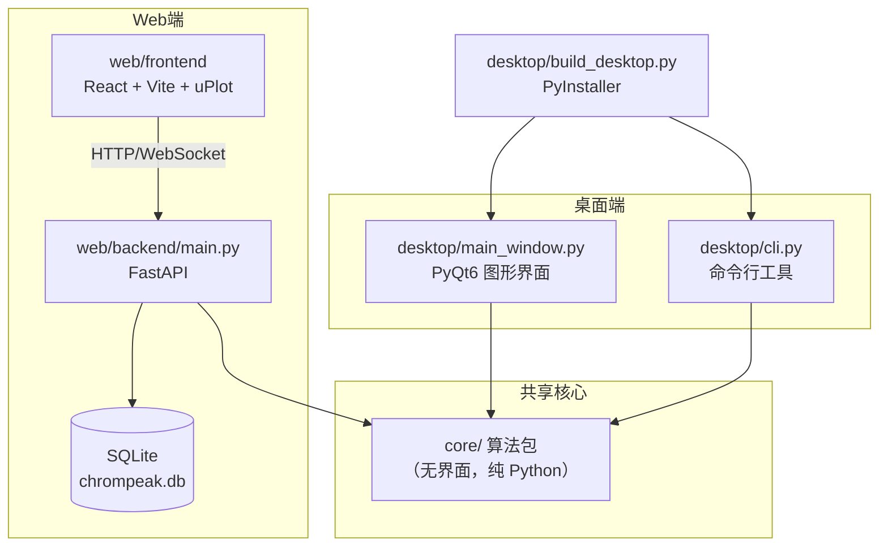

# ChromaPeak Studio · 色谱峰识别平台

> 一个开源的**气相 / 液相色谱峰识别**平台。同一套核心算法同时驱动 **桌面端（PyQt6 图形界面 + 命令行）** 与 **Web 端（React + FastAPI）**，可在本地一键打包成无需安装 Python 的 `.exe`，也能一键部署到 GitHub Pages / Cloudflare / Vercel / Netlify。

[](LICENSE)
[](https://www.python.org/)
[](https://nodejs.org/)

---

## 目录

- [这个项目能做什么](#这个项目能做什么)
- [整体架构](#整体架构)
- [目录结构一览](#目录结构一览)
- [快速开始](#快速开始)
  - [方式一：Web 端（最简单，免安装）](#方式一web-端最简单免安装)
  - [方式二：桌面 GUI 版（PyQt6）](#方式二桌面-gui-版pyqt6)
  - [方式三：命令行版（CLI / 批处理 / 服务器）](#方式三命令行版cli--批处理--服务器)
  - [方式四：直接下载打包好的 .exe](#方式四直接下载打包好的-exe)
- [每个文件的作用（新手必读）](#每个文件的作用新手必读)
  - [核心算法包 `core/`（与界面无关，可被两端复用）](#核心算法包-core与界面无关可被两端复用)
  - [桌面端 `desktop/`](#桌面端-desktop)
  - [Web 后端 `web/backend/`](#web-后端-webbackend)
  - [Web 前端 `web/frontend/`](#web-前端-webfrontend)
  - [测试、示例与部署配置](#测试示例与部署配置)
- [内置的 6 种识别算法](#内置的-6-种识别算法)
- [移动端与多设备适配](#移动端与多设备适配)
- [部署到各大平台](#部署到各大平台)
  - [1. GitHub Pages（自动化，推荐）](#1-github-pages自动化推荐)
  - [2. Cloudflare Pages](#2-cloudflare-pages)
  - [3. Vercel](#3-vercel)
  - [4. Netlify](#4-netlify)
- [接入真实后端 API](#接入真实后端-api)
- [开发过程中踩过的坑（避坑指南）](#开发过程中踩过的坑避坑指南)
- [常见问题 FAQ](#常见问题-faq)
- [许可证](#许可证)

---

## 这个项目能做什么

把一份色谱仪输出的 **CSV / TXT 数据**（两列：横轴时间 `x`、纵轴响应值 `y`），自动找出其中的 **色谱峰（peaks）**，给出每个峰的：

| 指标 | 含义 |
| --- | --- |
| `rt` | 保留时间（峰出现的位置） |
| `height` | 峰高 |
| `area` | 峰面积（积分） |
| `fwhm` | 半峰宽（峰宽度的衡量） |
| `asymmetry` | 不对称因子（拖尾程度） |
| `score` | 算法对该峰的置信度评分 |

平台内置 **6 种不同思路的峰识别算法**（导数法、小波变换、形态学、曲率法、指数修正高斯拟合、图神经网络），可以**同时跑多个算法并对比结果**，帮助判断峰是否真实存在。

---

## 整体架构



**核心设计思想**：`core/` 是一个**不带任何界面依赖**的纯算法包，桌面 GUI、命令行、Web 后端都只是它的"外壳"，这样算法只写一遍，三处共用，结果完全一致。

---

## 目录结构一览

```
chrompeak-studio/
├── core/                     # 核心算法包（纯 Python，无界面）—— 三端共用
│   ├── algorithms/           # 6 种峰识别算法
│   ├── io.py                 # 读取/写出色谱数据
│   ├── preprocess.py         # 基线校正、平滑等预处理
│   ├── peak_params.py        # 计算 FWHM / 不对称因子
│   ├── pipeline.py           # 统一调度入口（跑单个/全部算法）
│   ├── sample_data.py        # 生成演示数据（无需外部文件）
│   └── __main__.py           # 支持 `python -m core` 直接体验算法
├── desktop/                  # 桌面端
│   ├── main_window.py        # PyQt6 图形界面主窗口
│   ├── param_panel.py        # 根据算法参数自动生成表单
│   ├── batch_dialog.py       # 批量处理对话框
│   ├── cli.py                # 命令行版本（无界面）
│   ├── build_desktop.py      # 用 PyInstaller 打包成 .exe
│   ├── requirements.txt      # 桌面端依赖
│   └── installer.iss         # Inno Setup 安装包脚本（可选）
├── web/
│   ├── backend/              # FastAPI 后端
│   │   ├── main.py           # 接口与 WebSocket
│   │   ├── auth.py           # 注册/登录/JWT
│   │   ├── db.py             # SQLite 用户与项目存储
│   │   └── requirements.txt
│   └── frontend/             # React + Vite 前端
│       ├── src/
│       │   ├── App.tsx       # 主页面与交互逻辑
│       │   ├── api.ts        # 后端通信封装
│       │   ├── components/   # 图表、参数面板、结果表、登录
│       │   ├── utils/lttb.ts # 大数据降采样
│       │   └── styles.css    # 样式与移动端适配
│       ├── index.html
│       ├── vite.config.ts    # 构建配置（base: "./" 相对路径）
│       ├── vercel.json / netlify.toml / wrangler.toml  # 平台部署配置
│       └── package.json
├── tests/                    # 单元测试
├── sample_data/              # 演示用 CSV / 项目 JSON
├── .github/workflows/deploy.yml  # GitHub Actions 自动部署
└── start_desktop.bat         # 双击启动桌面端的脚本
```

---

## 快速开始

> 三个环境准备：
> - Python 3.13（推荐用虚拟环境 `venv`）
> - Node.js 20+（仅 Web 前端需要）
> - 核心算法只用 `numpy` / `scipy`，安装很轻量

### 方式一：Web 端（最简单，免安装）

Web 端是**纯静态前端**，即使没有后端也能用（前端内置示例数据、算法对比在前端做）。两种用法：

**A. 仅本地预览前端（不需要 Python）：**

```bash
cd web/frontend
npm install
npm run dev        # 打开 http://localhost:5173
```

**B. 完整运行（前端 + 后端 API + 登录/保存项目）：**

```bash
# 终端 1：启动后端
cd web/backend
python -m venv venv && venv\Scripts\activate   # Linux/macOS 用 source venv/bin/activate
pip install -r requirements.txt
uvicorn main:app --reload --port 8000

# 终端 2：启动前端
cd web/frontend
npm install
npm run dev
```

打开 http://localhost:5173 即可。前端通过 `vite.config.ts` 里的 `/api` 代理把请求转发到 `localhost:8000`，**本地开发没有跨域问题**。

### 方式二：桌面 GUI 版（PyQt6）

```bash
cd desktop
python -m venv venv && venv\Scripts\activate
pip install -r requirements.txt
python -m desktop.main_window     # 或直接双击 start_desktop.bat
```

界面左侧选算法 + 调参数，中间看色谱图与峰，右侧看结果表，支持导出 CSV / Excel / 图片。

### 方式三：命令行版（CLI / 批处理 / 服务器）

```bash
# 分析单个文件（--out 可导出 csv/xlsx）
python -m desktop.cli analyze sample_data/demo.csv --algorithms ALG-D ALG-E --out out.csv

# 用内置示例数据
python -m desktop.cli analyze sample --out out.csv

# 批量处理整个文件夹
python -m desktop.cli batch ./data_dir --out-dir out --algorithms ALG-D

# 保存为项目 JSON / 从项目 JSON 重算
python -m desktop.cli project data.csv --out project.json
python -m desktop.cli rerun   project.json --out peaks.csv
```

`python -m core` 也能直接体验核心算法（读取示例数据并输出各算法峰数）。

### 方式四：直接下载打包好的 .exe

`desktop/build_desktop.py` 用 PyInstaller 把 GUI 版和 CLI 版分别打包成独立 `.exe`，**目标电脑不需要安装 Python**：

```bash
pip install -r desktop/requirements.txt
python desktop/build_desktop.py
```

产物在 `dist/` 下：

- `dist/ChromaPeakStudio/ChromaPeakStudio.exe` —— 双击即用（无控制台窗口）
- `dist/ChromaPeakCLI/ChromaPeakCLI.exe` —— 命令行工具，可直接在 cmd / PowerShell / 服务器上跑

详见下文「[开发过程中踩过的坑](#开发过程中踩过的坑避坑指南)」中关于 PyInstaller 的注意事项。

---

## 每个文件的作用（新手必读）

下面按"从底层到外壳"的顺序，逐个说明文件的职责。你可以把它当成一份"源码地图"。

### 核心算法包 `core/`（与界面无关，可被两端复用）

| 文件 | 作用 |
| --- | --- |
| `core/__init__.py` | 让 `core` 成为一个可被 `import` 的包；对外暴露常用函数 |
| `core/__main__.py` | `python -m core` 的入口：生成示例数据、依次跑全部算法、打印峰数，方便无界面快速验证算法 |
| `core/algorithms/base.py` | **算法基类** `PeakAlgorithm`（抽象类）。定义所有算法都要实现的 `default_params()` 和 `detect()`；并提供公共工具：`_resolve`（参数取值）、`_local_maxima`（找局部极大值）、`_baseline_segment`（分段基线） |
| `core/algorithms/_helpers.py` | 峰后处理工具：`enforce_min_distance`（按最小峰间距去重）、`refine_apex`（把峰顶点精修到最优点）、`peak_boundaries`（确定峰的左右边界）、`local_baseline`（取峰附近局部基线用于积分） |
| `core/algorithms/derivative.py` | **ALG-D 导数法**：一阶导数过零点定位峰。最经典、最快 |
| `core/algorithms/cwt.py` | **ALG-W 连续小波变换**：用 Ricker（墨西哥帽）小波做多尺度脊线检测。因 `pywt` 在 Python 3.13 暂无轮子，本文件**手写实现了 Ricker 小波与 CWT**，无第三方硬依赖 |
| `core/algorithms/tophat.py` | **ALG-M 形态学顶帽**：用形态学开运算提取"比背景亮的突起"，对宽峰友好 |
| `core/algorithms/curvature.py` | **ALG-C 曲率法**：用二阶导数（曲率）找凹点。阈值采用"相对阈值" `0.2 * 最大曲率`，避免绝对值在不同信号量级下失效 |
| `core/algorithms/emg_fit.py` | **ALG-E 指数修正高斯拟合**：用 EMG 模型拟合峰并解重叠峰。内部自带基线校正；阈值相对化 `0.2 * ymax`，并先做 Savitzky-Golay 平滑抑制噪声 |
| `core/algorithms/gnn_deconv.py` | **ALG-GNN 图神经网络解卷积**：优先加载 `models/` 下的 ONNX 模型做推理；若无模型则用"二阶导 + 相对阈值"回退。阈值相对化 `thr = -0.2 * dmax` |
| `core/algorithms/__init__.py` | **算法注册表**：`_REGISTRY` 收集全部算法；提供 `all_algorithms()`、`get_algorithm()`、`algorithm_meta()` 供桌面/Web 自动列出可用算法及其参数 |
| `core/io.py` | 数据读写：`load_chromatogram()`（读 CSV/TXT，自动识别两列）、`load_from_bytes()`（供 Web 从上传字节流读取）、`save_peaks_csv()`（导出峰为 CSV，**兼容 Peak 对象与字典两种格式**） |
| `core/preprocess.py` | 预处理：`PreprocessOptions`、`_airpls_baseline`（非对称最小二乘基线校正）、`baseline_correction`、`savgol_smooth`（Savitzky-Golay 平滑）、`preprocess`（统一入口） |
| `core/peak_params.py` | 峰指标计算：`calc_peak_params`（算单峰 FWHM/不对称）、`calc_all`（批量） |
| `core/pipeline.py` | **统一调度层**：`available_algorithms()`（列出元信息）、`analyze(x, y, name, params)`（跑单个算法）、`run_algorithms(x, y, names, params)`（跑多个，返回 `{x, y, y_proc, results}`）。桌面端与 Web 后端都调用它 |
| `core/sample_data.py` | 演示数据生成：`synthetic_chromatogram()`（带噪声的合成色谱）、`overlapping_pair()`（重叠双峰，用于测试解卷积）、`_emg()`（指数修正高斯函数，已做数值溢出保护） |

### 桌面端 `desktop/`

| 文件 | 作用 |
| --- | --- |
| `desktop/main_window.py` | **PyQt6 主窗口**：左侧算法列表 + 参数面板，中间色谱图（pyqtgraph）+ 结果表 + 工具栏。参数改动后 **200ms 防抖**实时重算预览；支持导出 CSV / Excel / PNG / 批量 |
| `desktop/param_panel.py` | `ParamPanel`：读取算法 `ParamSpec`，**自动生成参数表单**（滑块/输入框/勾选），改动时发出 `paramsChanged` 信号 |
| `desktop/batch_dialog.py` | `BatchDialog`：选择文件夹 + 算法，批量跑并把每个文件的峰导出到输出目录 |
| `desktop/cli.py` | **命令行版**：`analyze` / `batch` / `project` / `rerun` 四个子命令，适合服务器、CI、批处理。与 GUI 共用同一份 `core` |
| `desktop/build_desktop.py` | **打包脚本**：调用 PyInstaller 生成两个 `.exe`（GUI 用 `--windowed`，CLI 用 `--console`），并把 `core` 与 `models` 作为数据打包进去 |
| `desktop/requirements.txt` | 桌面端依赖清单（PyQt6 / pyqtgraph / numpy / scipy / onnxruntime / openpyxl / PyInstaller） |
| `desktop/installer.iss` | Inno Setup 脚本，可把两个 `.exe` 打包成一个 Windows 安装程序（可选） |
| `desktop/__init__.py` | 让 `desktop` 成为可 `import` 的包 |

### Web 后端 `web/backend/`

| 文件 | 作用 |
| --- | --- |
| `web/backend/main.py` | **FastAPI 主程序**。路由：`/register`、`/login`、`/algorithms`、`/analyze`、`/analyze_batch`、`/projects`（增/列/查）、`/ws/analyze`（WebSocket 流式推理）；挂载 `/exports` 静态目录用于下载批量结果。`main:app` 是 uvicorn 启动入口 |
| `web/backend/auth.py` | **鉴权**：用 `bcrypt` 做密码哈希/校验（**未用 passlib**，见避坑指南），`python-jose` 签发/校验 JWT；`get_current_user` 依赖项保护需要登录的接口 |
| `web/backend/db.py` | **SQLite 持久化**：`User`、`Project` 两张表（SQLAlchemy ORM）；`chrompeak.db` 默认在后端目录，可用环境变量 `CHROMPEAK_DB` 指定路径。`x_data`/`y_data` 以 JSON 文本存储 |
| `web/backend/requirements.txt` | 后端依赖（fastapi / uvicorn / sqlalchemy / bcrypt / python-jose / python-multipart） |
| `web/backend/__init__.py` | 包标识，使 `auth` / `db` 可作为相对导入的子模块 |

### Web 前端 `web/frontend/`

| 文件 | 作用 |
| --- | --- |
| `index.html` | 应用入口 HTML，`<div id="root">` 挂载点；引入 `./assets/...`（**相对路径**，便于部署到子目录） |
| `vite.config.ts` | Vite 配置：`base: "./"`（构建产物全部用相对路径）、`/api` 代理到 `localhost:8000`（本地开发免跨域）、`chunkSizeWarningLimit` 放宽 |
| `package.json` | 依赖与脚本：`dev` / `build` / `preview`。依赖仅 `react`、`react-dom`、`uplot` |
| `src/main.tsx` | React 渲染入口 |
| `src/App.tsx` | **主页面与全部交互**：文件上传、参数调优后 **250ms 防抖 + WebSocket 流式重算**（边滑边出峰）、项目保存/加载、JSON 导入导出、ZIP 批量。是前端逻辑核心 |
| `src/api.ts` | **后端通信封装**：`API_BASE`（优先读 `VITE_API_BASE`，否则 `/api`）、`api` 对象（register/login/algorithms/analyze/analyzeBatch/projects）、`wsUrl()` 生成 WebSocket 地址。集中所有请求，改地址只动这一处 |
| `src/components/Chromatogram.tsx` | **色谱图组件**（uPlot）：每个算法一个彩色散点序列（`ALG_COLORS`），用 LTTB 降采样保证大文件流畅，`ResizeObserver` 跟随容器宽度自适应；序列数量变化时重建图表 |
| `src/components/AlgorithmPanel.tsx` | 算法开关 + 参数表单（复用 `ParamSpec`） |
| `src/components/ResultTable.tsx` | 结果表：列出所有算法的峰（rt / height / area / fwhm 等） |
| `src/components/Auth.tsx` | 登录/注册表单 |
| `src/utils/lttb.ts` | **LTTB 降采样算法**：把上万点的曲线压缩到屏幕宽度的 2 倍点数，保留视觉形状 |
| `src/styles.css` | 全部样式（深色主题 CSS 变量）+ **移动端适配**（`@media` 断点，见下文） |
| `src/vite-env.d.ts` | 声明 `vite/client` 类型，使 `import.meta.env` 可用 |
| `public/404.html` | SPA 兜底页（刷新深层链接时不 404） |
| `vercel.json` / `netlify.toml` / `wrangler.toml` | 三大平台的部署配置（重写到 `index.html`，启用 SPA） |

### 测试、示例与部署配置

| 文件 | 作用 |
| --- | --- |
| `tests/test_core.py` | 核心算法单元测试（10 个用例，覆盖各算法能出峰、参数边界等），`pytest` 运行 |
| `conftest.py` | pytest 配置（把项目根加入 `sys.path`） |
| `sample_data/*.csv` | 演示 CSV（单文件 / 批处理 / exe 测试） |
| `sample_data/project.json` | 项目 JSON 示例，用于演示导入导出 |
| `sample_data/out/` | CLI 运行产物示例 |
| `.github/workflows/deploy.yml` | **GitHub Actions**：push 到 `main` 时自动 `npm ci && npm run build`，把 `web/frontend/dist` 部署到 `gh-pages` 分支 |
| `start_desktop.bat` | Windows 双击启动桌面端的批处理（自动建 venv 并安装依赖） |

---

## 内置的 6 种识别算法

| 算法 | 名称 | 思路 | 适合场景 |
| --- | --- | --- | --- |
| `ALG-D` | 导数法 | 一阶导数过零点 | 快速初筛、信号干净 |
| `ALG-W` | 小波变换 | Ricker 小波多尺度脊线 | 峰宽差异大、重叠 |
| `ALG-M` | 形态学顶帽 | 开运算提取突起 | 宽峰、基线漂移 |
| `ALG-C` | 曲率法 | 二阶导数凹点 | 对称峰、尖锐峰 |
| `ALG-E` | EMG 拟合 | 指数修正高斯拟合 | 拖尾峰、重叠峰解卷积 |
| `ALG-GNN` | 图神经网络 | ONNX 推理（无模型则回退二阶导） | 复杂/已知分布数据 |

> 多算法对比的价值：**没有单一算法是万能的**。某个峰如果多个算法都报出来，基本可确认；只有某个奇怪的算法报出、其他都没有，大概率是噪声。

---

## 移动端与多设备适配

前端已针对手机、平板、桌面做了响应式适配，关键做法：

1. **相对路径构建**：`vite.config.ts` 里 `base: "./"`，构建产物 `index.html` 引用 `./assets/...`，因此**部署到任意子路径（如 `用户名.github.io/chrompeak-studio`）都不会白屏**。

2. **流式布局 + 断点**（`src/styles.css`）：
   - 桌面（> 860px）：左 `300px` 侧边栏 + 右侧主区横排。
   - 平板 / 横屏手机（≤ 860px）：`.layout` 改为竖向堆叠，侧边栏占满宽度、去掉最大高度限制；按钮加大到 `10px 12px` 触摸更友好；参数表单列宽收窄。
   - 小屏手机（≤ 480px）：隐藏顶栏用户名、卡片内边距收紧，信息密度更高。

3. **图表自适应**：`Chromatogram.tsx` 用 `ResizeObserver` 监听容器宽度，窗口/屏幕变化（含手机旋转）时实时 `setSize`，曲线始终填满可用宽度。

4. **大数据不卡**：`utils/lttb.ts` 用最大三角桶降采样，即使几万点也只在屏幕上绘制约 `2 × 宽度` 个点。

5. **SPA 兜底**：`public/404.html` + 各平台 `rewrites` 配置，保证在 GitHub Pages / Cloudflare / Vercel / Netlify 上刷新任意路径都不会 404。

---

## 部署到各大平台

前端是**纯静态产物**（`web/frontend/dist`），所以下面四种方式本质都是"构建 → 把 dist 托管为静态站点"。**构建命令统一为**：

```bash
cd web/frontend
npm install
npm run build      # 产物在 web/frontend/dist
```

### 1. GitHub Pages（自动化，推荐）

仓库已包含 `.github/workflows/deploy.yml`，**推送到 `main` 分支即自动构建并发布到 `gh-pages` 分支**：

```bash
git add . && git commit -m "feat: 更新 ChromaPeak Studio"
git push origin main
```

然后在 GitHub 仓库 **Settings → Pages → Source** 选择 `gh-pages` 分支、`/ (root)`，保存后访问 `https://<用户名>.github.io/<仓库名>/`。

> 因为用了相对路径 `base: "./"`，子路径部署无需额外配置。

### 2. Cloudflare Pages

配置文件 `web/frontend/wrangler.toml` 已就绪。

- **方式 A（Dashboard）**：登录 Cloudflare Pages → 连接 Git 仓库 → 构建命令 `npm run build`，构建目录（输出）填 **`web/frontend/dist`**（注意是子目录）。
- **方式 B（CLI）**：
  ```bash
  cd web/frontend
  npm install -g wrangler
  wrangler login
  wrangler pages deploy dist
  ```

### 3. Vercel

配置文件 `web/frontend/vercel.json` 已写好：所有路由重写到 `index.html`（SPA 模式）。

- 在 Vercel 导入仓库，**Root Directory** 设为 `web/frontend`，构建命令 `npm run build`，输出目录 `dist`。
- 或直接 `vercel` CLI：在 `web/frontend` 目录执行 `npx vercel`。

### 4. Netlify

配置文件 `web/frontend/netlify.toml` 已写好：`publish = "dist"`，并把 `/*` 重写到 `/index.html`。

- 在 Netlify 导入仓库，构建命令 `npm run build`，发布目录 `dist`。
- 或直接拖拽 `web/frontend/dist` 文件夹到 Netlify Drop。

---

## 接入真实后端 API

前端默认把请求发到 `/api`（再代理到本地 8000）。部署到公网时，有两种方式让前端连上你的后端：

1. **同源部署**：把 FastAPI 也部署到同一域名（例如 Cloudflare Workers / 容器），保持 `/api` 前缀即可，无需改代码。
2. **跨域指定地址**：构建前端前设置环境变量，让 `API_BASE` 指向后端：
   ```bash
   # Linux/macOS
   VITE_API_BASE=https://api.yourdomain.com npm run build
   # Windows PowerShell
   $env:VITE_API_BASE="https://api.yourdomain.com"; npm run build
   ```
   详见 `src/api.ts` 顶部的 `API_BASE` 取值逻辑。

> 注意：`auth.py` 里 `SECRET_KEY` 默认是 `change-me-in-production`，**生产环境务必用环境变量 `CHROMPEAK_SECRET` 设置一个随机长字符串**。数据库 `chrompeak.db` 默认明文存于后端目录，部署时注意备份与权限。

---

## 开发过程中踩过的坑（避坑指南）

把真实遇到并修复的问题列出来，能帮你省下大量调试时间：

### 1. `pywt`（PyWavelets）在 Python 3.13 装不上
- **现象**：`pip install pywt` 报 `No matching distribution found for pywt`。
- **原因**：Python 3.13 太新，部分 C 扩展轮子尚未发布。
- **解决**：不再依赖 `pywt`，在 `core/algorithms/cwt.py` **手写 Ricker 小波与 CWT 卷积**，零额外依赖，算法效果一致。

### 2. NumPy 2.0 删除了 `np.math` 和 `np.trapz`
- **现象**：`AttributeError: module 'numpy' has no attribute 'math'` / `'trapz'`。
- **原因**：NumPy 2.0 移除了一批旧别名。
- **解决**：`np.math` → 改用标准库 `math`（如 `math.erf`）；`np.trapz` → 改为 `np.trapezoid`（涉及 curvature / cwt / emg_fit / gnn_deconv / derivative / tophat 共 8 处）。

### 3. 算法阈值用"绝对值"在不同信号量级下失效
- **现象**：ALG-C 一个峰都找不到；ALG-E 把噪声当峰（报出 33 个）；ALG-GNN 第一次 18 个、第二次只剩 1 个。
- **原因**：默认阈值是写死的绝对数值，但真实色谱的二阶导数/峰高量级差异很大。
- **解决**：统一改为**相对阈值**——`ALG-C` 用 `0.2 * 最大曲率`；`ALG-E` 用 `0.2 * ymax` 并先做基线校正 + Savitzky-Golay 平滑；`ALG-GNN` 回退阈值用 `thr = -0.2 * dmax`。经验：**峰检测阈值永远相对化，别写死绝对值**。

### 4. EMG 拟合数值溢出
- **现象**：`np.exp` 报 overflow / 出现 `nan`。
- **解决**：对指数参数做 `clip(-50, 50)` 截断，并用 `np.nan_to_num` 兜底，避免极端参数把拟合打爆。

### 5. `save_peaks_csv` 收到字典而非对象
- **现象**：`AttributeError: 'dict' object has no attribute 'to_dict'`。
- **原因**：`run_algorithms` 返回的是 dict，而写 CSV 时按 `Peak` 对象处理。
- **解决**：在 `core/io.py` 里做兼容：`pk.to_dict() if hasattr(pk, "to_dict') else pk`，两种格式都能写。

### 6. `passlib` + `bcrypt 4.x` 报错
- **现象**：`ValueError: password cannot be longer than 72 bytes`（passlib 探测 bcrypt 后端时抛错）。
- **解决**：**弃用 passlib**，在 `web/backend/auth.py` 里直接调用 `bcrypt.hashpw` / `bcrypt.checkpw`，`requirements.txt` 改为只依赖 `bcrypt>=4.0`。更简单也少一层间接。

### 7. PyInstaller 打包时 `node.exe cli.js` 被当成一条命令
- **现象**：`npm run build` 在脚本里报 `No such file or directory`。
- **原因**：拼接命令行时把 `node.exe` 和 `cli.js` 合成了一个字符串，被当成单个可执行文件。
- **解决**：把 node 可执行文件路径和 `npm-cli.js` 拆成**两个独立且各自加引号**的变量再调用（见下面"构建前端"命令写法）。同理，Windows 下调用 `node` 务必用绝对路径、逐段引用。

### 8. 前端 `import.meta.env` 类型报错
- **现象**：`Property 'env' does not exist on type 'ImportMeta'`。
- **解决**：在 `src/` 下新增 `vite-env.d.ts`，写入 `/// <reference types="vite/client" />`，TS 即可识别 Vite 注入的环境变量。

### 9. uPlot `setSeries()` 必须传索引
- **现象**：`setSeries(uSeries)` 报 `Expected 2-3 arguments, but got 1`。
- **原因**：uPlot 的 `setSeries(idx, series, draw?)` 需要指定序列索引，不能直接整体替换。
- **解决**：改为"**序列数量不变时 `setData` 刷新数据；数量变了就销毁并重建图表**"的策略（`Chromatogram.tsx`），既正确又避免闪烁。

### 10. 桌面端打包后找不到 `core` / `models`
- **现象**：双击 `.exe` 报 `ModuleNotFoundError: core`。
- **解决**：`build_desktop.py` 通过 `--add-data` 把 `core` 和 `models` 目录打进包，并配合 `sys._MEIPASS` 在运行时定位；后端 `main.py` 也通过 `sys.path.insert(0, ROOT)` 把项目根加入搜索路径。打包时这两个目录必须一起带上。

---

## 常见问题 FAQ

**Q：没有后端能用 Web 端吗？**
A：能。前端本身内置示例数据和算法对比逻辑，不连后端也能看效果。只是"保存项目""登录"需要后端。

**Q：CSV 应该是什么格式？**
A：两列数值，第一行可以是表头（程序会自动跳过非数字行）。第一列是 `x`（时间/索引），第二列是 `y`（响应值）。

**Q：打包好的 exe 有多大？**
A：GUI 版约 23MB，CLI 版约 23MB，拷贝整个 `dist/<名字>/` 文件夹即可在没有 Python 的电脑上运行。

**Q：算法结果不准怎么办？**
A：先看多算法对比，若只有一种算法报出峰，多半是噪声；再调对应算法的阈值/平滑参数（GUI 和 Web 都能实时调，250~200ms 防抖）。

**Q：如何加自己的算法？**
A：在 `core/algorithms/` 新建一个文件，继承 `PeakAlgorithm` 实现 `detect()`，然后在 `core/algorithms/__init__.py` 的 `_REGISTRY` 里注册。桌面端和 Web 端会**自动**出现新算法及其参数表单，无需改界面代码。

---

## 许可证

本项目以 MIT 许可证开源，可自由用于学习、研究、商业（请保留版权声明）。

---

> 提示：本 README 面向新手编写，力求"每个文件都讲清楚作用"。如果你发现某处不够明白，欢迎提 Issue 或 PR 完善。
